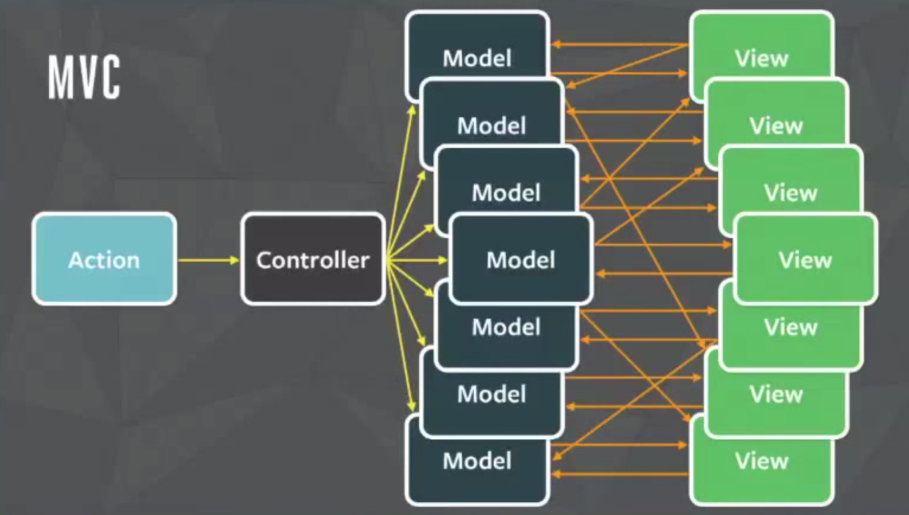

### Me

[题叶][tiye],  @jiyinyiyong -- FP, GUI & Writing
ChenYong@Teambition

简聊前端, React 中文社区维护者

[tiye]: http://tiye.me

[@clojure-china](http://weibo.com/clojurechina)
[@DesignerNewsRSS](http://weibo.com/designernews)

----

### CirruScript

http://script.cirru.org/

```coffee
Cirru AST -> ES6 AST(Babel) -> ES5 AST -> JavaScript
```

```coffee
var greet $ \ (name)
  console.log $ + ":Hi! " name

greet :Shanghai
```

----

### React 和 Flux

[React Flux pros cons][flux]

[flux]: https://www.quora.com/What-are-the-pros-and-cons-of-React-js-and-Flux-Are-they-the-future-of-front-end-development


----

### Redux

[Redux 中文文档][chinese], @camsong

[chinese]: http://camsong.github.io/redux-in-chinese/


----

### 代码仓库

核心 [redux](https://github.com/rackt/redux)
绑定 [react-redux](https://github.com/rackt/react-redux)
调试工具 [redux-devtools](https://github.com/gaearon/redux-devtools)

[simplest-redux-example][simplest], 60sloc

[simplest]: https://github.com/jackielii/simplest-redux-example/blob/master/index.js

----

### Redux Demo

[Todolist](https://github.com/matthew-sun/blog/issues/18)


----

### Time traveling Debugger

Designing on Principle, Bret Victor, 2012


----

### Persistent Data

[Persistent Data Structure][vector]

[vector]: http://hypirion.com/musings/understanding-persistent-vector-pt-1


----

### Single Store

[MVC pattern](http://amix.dk/blog/post/19615)


----

### Single Store 的反面

Backbone:



----

### Unidirectional Data Flow

[Unidirectional UI Architectures][unidirectional]

[unidirectional]: http://staltz.com/unidirectional-user-interface-architectures.html


----

### 优点在哪

Model, View, Actions


----

### 回溯 Model

记录所有的 Model 的数据, 再逐一查看


----

### 代码实现

[actions-recorder](https://github.com/teambition/actions-recorder)

```coffee
core =
  initial: schema.store # initial data of Store
  records: []
  pointer: 0
  isTravelling: false
  updater: (store actionType actionData) ->
    switch actionType
      when 'update' then update store actionData
      else store
```

----

### Reduce

从 `initial` 和 `records` 推导出 `store`:

```coffee
getNewStore = ->
  if core.isTravelling and core.pointer >= 0
    next = core.pointer + 1
    core.records.slice(0, next).reduce (acc, action) ->
      core.updater acc, action.get(0), action.get(1)
    , core.initial
  else core.records.reduce (acc, action) ->
    core.updater acc, action.get(0), action.get(1)
  , core.initial
```

----

### 怎么得到 Store

```coffee
Store = Actions.reduce(Updater, InitialStore)
```


----

### 关于 Store 的理解

Model 对应的不是 Store
Model 对应 Initial Store 和 Actions


----

### 想法

* Debugger

保存所有 Actions 和 Store, 用于调试

* Pending request

Action 的网络请求, 控制回滚

----

### 地址栏

地址栏是一个 React 组件

* `this.props.value`
* `this.props.onChange`


[router-view](http://router-view.mvc-works.org/)

----

### FAQ

交流 http://react-china.org

Thanks.
