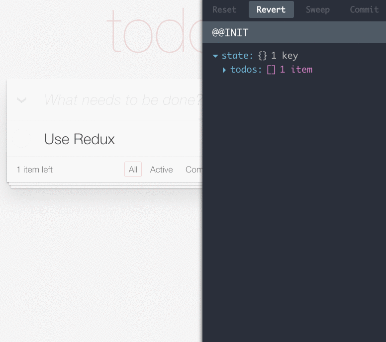

### 用 Redux 的理念改进前端的 Model

关于 Redux

* Time Travelling Debugger
* 单向数据流
* actions-recorder

----

### Me

[题叶][tiye],  @jiyinyiyong -- FP, GUI & Writing

* [@clojure-china](http://weibo.com/clojurechina)
* [@DesignerNewsRSS](http://weibo.com/designernews)

React 中文社区维护者

ChenYong@Teambition 简聊前端

[tiye]: http://tiye.me

----

### 简聊

<http://jianliao.com> 前端基于 React.js

> 谈工作, 用简聊

> 轻量、好用的团队沟通工具

----

### CirruScript

个人项目, 类似 CoffeeScript <http://script.cirru.org/>

    Cirru AST -> ES6 AST(Babel) -> ES5 AST -> JavaScript

一切皆是表达式! [Demo][demo]

[demo]:https://github.com/Cumulo/multi-user-markdown/blob/master/src/app/editor.cirru

    var greet $ \ (name)
      console.log $ + ":Hi! " name

    greet :Shanghai

----

### React 和 Flux

[React Flux pros cons][flux]

[flux]: https://www.quora.com/What-are-the-pros-and-cons-of-React-js-and-Flux-Are-they-the-future-of-front-end-development

----

### Redux

[Redux 中文文档][chinese], @camsong

[chinese]: http://camsong.github.io/redux-in-chinese/

----

### Redux Demo

[Todolist](https://github.com/matthew-sun/blog/issues/18)

----

### 代码仓库

* 核心 [redux](https://github.com/rackt/redux)
* 绑定 [react-redux](https://github.com/rackt/react-redux)
* 调试工具 [redux-devtools](https://github.com/gaearon/redux-devtools)

[simplest-redux-example][simplest], 60sloc

[simplest]: https://github.com/jackielii/simplest-redux-example/blob/master/index.js

----

### Time travelling Debugger

Designing on Principle, Bret Victor, 2012

----

### Multiple Store 的问题

Backbone:

----

### Single Store

[MVC pattern](http://amix.dk/blog/post/19615)

----

### Unidirectional Data Flow

[Unidirectional UI Architectures][unidirectional]

[unidirectional]: http://staltz.com/unidirectional-user-interface-architectures.html

----

### 单向数据流

不是修改数据, 而是生成新的数据

----

### 不可变数据(immutable)

[Persistent Data Structure][vector]

[vector]: http://hypirion.com/musings/understanding-persistent-vector-pt-1

----

### 清晰明确的数据流

Model, View, Actions 分层清晰, 前端走到这一步不容易

----

### 回溯 Model

记录所有的 Model 的数据, 再逐一查看

----

### 代码实现

[actions-recorder](https://github.com/teambition/actions-recorder)

    core =
      initial: schema.store # 初始数据
      records: [] # Actions 的队列
      pointer: 0 # 当前回溯位置
      isTravelling: false
      updater: (store, actionType, actionData) ->
        switch actionType
          when 'update' then update(store, actionData)
          else store

----

### Reduce

从 `initial` 和 `records` 推导出 `store`:

    getNewStore = ->
      if core.isTravelling and core.pointer >= 0
        next = core.pointer + 1
        core.records.slice(0, next).reduce (acc, action) ->
          core.updater acc, action.get(0), action.get(1)
        , core.initial
      else core.records.reduce (acc, action) ->
        core.updater acc, action.get(0), action.get(1)
      , core.initial

----

### 怎么得到 Store

    Store = Actions.reduce(Updater, InitialStore)

----

### 关于 Store 的理解

Model 对应的不是 Store
Model 对应 Initial Store 和 Actions

----

### 想法

可以探索:

* 根据 Actions 和 Store, 查找 bug
* 处理 Pending request 的网络请求, 控制回滚
* 保存 Actions 用来重演和测试界面

----

### 地址栏

地址栏是一个 React 组件

* `this.props.value`
* `this.props.onChange`

[router-view](http://router-view.mvc-works.org/)

----

### 交流

<http://nav.react-china.org>

Thanks.
